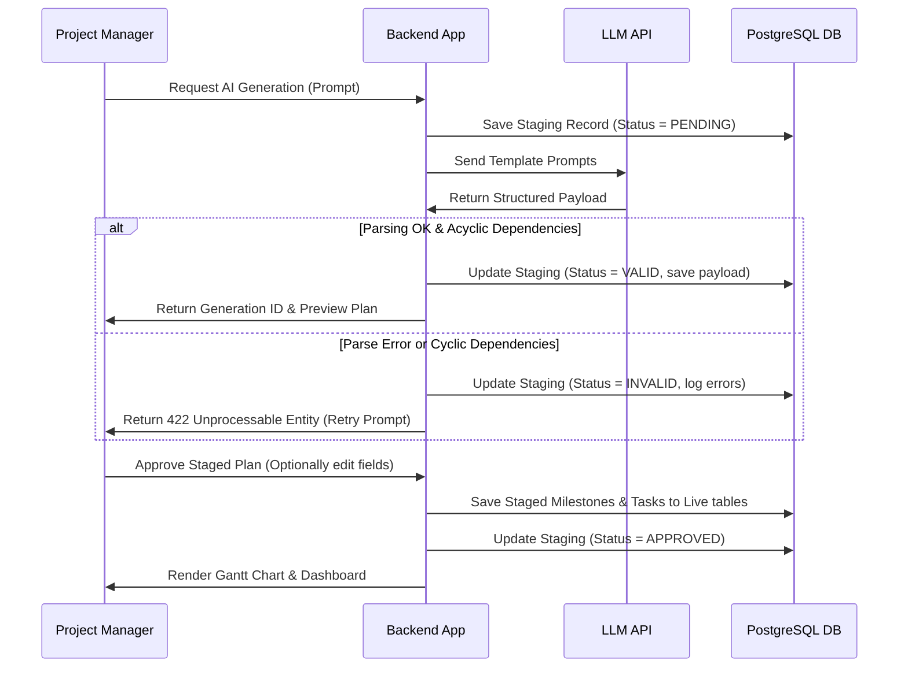

# AI Prompt and Integration Design

This document details prompt engineering templates, JSON schemas for structural enforcement, backend validation, and the auditing workflow for the AI engine.

---

## Safety Constraints and Rules

1. **Staging / Sandbox Isolation**: The LLM will never make direct changes to the database. All plan and report generations are written into the `ai_generations` table first. The PM must review, edit, and click "Approve" before any creation or updates are applied to the active schedule.
2. **Numeric Claims Limitation**: The LLM must not compute progress percentages, workload figures, or budget numbers. All math and analytical charts must rely on deterministic backend algorithms. The LLM acts solely as a text summarizer, risk recommender, and task decomposition engine. It only reads calculated statistics passed in its context window and must not invent other metrics.
3. **Structured Format Guardrails**: System instructions will enforce JSON output. If the response fails parsing, the backend logs it as `INVALID` in `ai_generations` and returns a fallback structure or error code.

---

## 1. Project Plan Generation

### Prompt Template (System Prompt + User Metadata Context)
```text
System:
You are an expert software project management assistant. You assist project managers in drafting structured project schedules.
You must output your response in valid JSON matching the schema provided below. Do not add markdown wrappers like ```json or trailing comments.
Ensure that the task dependency graph is acyclic. All dependency references must match valid task tempId numbers within the plan.

Project Metadata Context:
- Name: {projectName}
- Description: {projectDescription}
- Start Date: {startDate}
- Deadline: {deadline}
- Budget: ${budget}
- Methodology: {methodology} (Waterfall or Scrum)
- Target Team Size: {teamSize}

Current Workspace Skills:
Available team skills for task mapping: {skillsList}

User Command:
{userPrompt}
```

### Enforced Output JSON Schema (JSON Schema Draft-07)
```json
{
  "$schema": "http://json-schema.org/draft-07/schema#",
  "title": "AiProjectPlanResponse",
  "type": "object",
  "properties": {
    "milestones": {
      "type": "array",
      "items": {
        "type": "object",
        "properties": {
          "milestoneName": { "type": "string" },
          "tasks": {
            "type": "array",
            "items": {
              "type": "object",
              "properties": {
                "tempId": { "type": "integer" },
                "name": { "type": "string" },
                "description": { "type": "string" },
                "estimatedDurationDays": { "type": "integer", "minimum": 1 },
                "priority": { "type": "string", "enum": ["LOW", "MEDIUM", "HIGH", "CRITICAL"] },
                "dependencies": {
                  "type": "array",
                  "items": { "type": "integer" }
                },
                "requiredSkills": {
                  "type": "array",
                  "items": { "type": "string" }
                }
              },
              "required": ["tempId", "name", "estimatedDurationDays", "priority", "dependencies"]
            }
          }
        },
        "required": ["milestoneName", "tasks"]
      }
    },
    "assumptions": {
      "type": "array",
      "items": { "type": "string" }
    },
    "suggestedRisks": {
      "type": "array",
      "items": {
        "type": "object",
        "properties": {
          "title": { "type": "string" },
          "description": { "type": "string" },
          "severity": { "type": "string", "enum": ["LOW", "MEDIUM", "HIGH"] }
        },
        "required": ["title", "description", "severity"]
      }
    }
  },
  "required": ["milestones", "assumptions", "suggestedRisks"]
}
```

---

## 2. Weekly Status Report Generation

### Prompt Template
```text
System:
You are an AI assistant specialized in compiling project status updates. Your job is to draft a weekly status report based on the provided project dashboard metrics.
Draft the report in clean Markdown format containing three sections: Executive Summary, Key Accomplishments, and Recommendations for Mitigating Detected Bottlenecks/Risks.
Do not invent numerical facts. Stick strictly to the numbers provided below.

Project Data Context:
- Project Name: {projectName}
- Date Range: {weekStartDate} to {weekEndDate}
- Current Progress: {progressPercentage}%
- Budget Burn: ${actualSpend} spent of ${totalBudget} budget
- Completed Tasks this week: {completedTasksList}
- Delayed / Overdue Tasks: {delayedTasksList}
- Active Workload Bottlenecks: {overloadLogs}
- Detected Risks: {detectedRisksList}
```

---

## Backend Validation and Workflow

The following flowchart outlines how the backend processes AI generations to guarantee data security:


