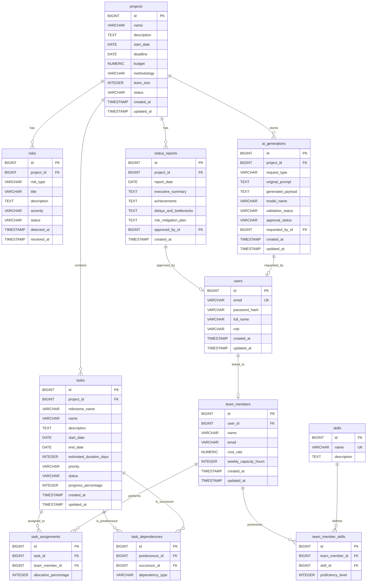

# Database Design and Entity Relationship Diagram

This document details the relational database schema, tables, column constraints, indexing strategy, and Entity Relationship Diagram (ERD) for the AI Project Manager platform.

---

## Entity Relationship Diagram (ERD)

The following Mermaid diagram outlines the table relationships in our PostgreSQL database:

---

## Detailed Table Specifications

### 1. `users` Table
Stores login credentials and roles.
* `id` (BIGINT, Primary Key, Auto-increment)
* `email` (VARCHAR(255), Not Null, Unique Index)
* `password_hash` (VARCHAR(255), Not Null)
* `full_name` (VARCHAR(150), Not Null)
* `role` (VARCHAR(50), Not Null) - Values: `ROLE_PM`, `ROLE_TEAM_MEMBER`
* `created_at` / `updated_at` (TIMESTAMP, Not Null)

### 2. `projects` Table
Stores high-level metadata for each managed software project.
* `id` (BIGINT, Primary Key, Auto-increment)
* `name` (VARCHAR(255), Not Null)
* `description` (TEXT)
* `start_date` (DATE, Not Null)
* `deadline` (DATE, Not Null)
* `budget` (NUMERIC(15,2), Not Null)
* `methodology` (VARCHAR(50), Not Null) - Values: `WATERFALL`, `SCRUM`
* `team_size` (INTEGER, Not Null)
* `status` (VARCHAR(50), Not Null) - Values: `PLANNING`, `IN_PROGRESS`, `COMPLETED`, `ARCHIVED`
* `created_at` / `updated_at` (TIMESTAMP, Not Null)

### 3. `team_members` Table
Stores employee profile metrics.
* `id` (BIGINT, Primary Key, Auto-increment)
* `user_id` (BIGINT, Nullable, Foreign Key -> `users.id`) - Connects registered users to team member logs.
* `name` (VARCHAR(255), Not Null)
* `email` (VARCHAR(255), Not Null)
* `cost_rate` (NUMERIC(10,2), Not Null) - Cost rate per day/hour.
* `weekly_capacity_hours` (INTEGER, Not Null) - Typically 40.
* `created_at` / `updated_at` (TIMESTAMP, Not Null)

### 4. `skills` Table
Global registry of technical skills.
* `id` (BIGINT, Primary Key, Auto-increment)
* `name` (VARCHAR(100), Not Null, Unique Index)
* `description` (TEXT)

### 5. `team_member_skills` Table
Association table between team members and skills with proficiency ratings.
* `id` (BIGINT, Primary Key, Auto-increment)
* `team_member_id` (BIGINT, Not Null, Foreign Key -> `team_members.id`)
* `skill_id` (BIGINT, Not Null, Foreign Key -> `skills.id`)
* `proficiency_level` (INTEGER, Not Null) - Constraint: 1 to 5.

### 6. `tasks` Table
Stores task items. In Waterfall, tasks represent scheduled work items. In Scrum, they map to backlog stories.
* `id` (BIGINT, Primary Key, Auto-increment)
* `project_id` (BIGINT, Not Null, Foreign Key -> `projects.id`)
* `milestone_name` (VARCHAR(150), Nullable) - Grouping attribute for phases/sprints.
* `name` (VARCHAR(255), Not Null)
* `description` (TEXT)
* `start_date` (DATE, Nullable) - Calculated by scheduling engine.
* `end_date` (DATE, Nullable) - Calculated by scheduling engine.
* `estimated_duration_days` (INTEGER, Not Null) - Initial work estimate.
* `priority` (VARCHAR(50), Not Null) - Values: `LOW`, `MEDIUM`, `HIGH`, `CRITICAL`
* `status` (VARCHAR(50), Not Null) - Values: `TODO`, `IN_PROGRESS`, `DONE`
* `progress_percentage` (INTEGER, Not Null) - Range: 0 to 100.
* `created_at` / `updated_at` (TIMESTAMP, Not Null)

### 7. `task_dependencies` Table
Maintains dependency networks between tasks.
* `id` (BIGINT, Primary Key, Auto-increment)
* `predecessor_id` (BIGINT, Not Null, Foreign Key -> `tasks.id`)
* `successor_id` (BIGINT, Not Null, Foreign Key -> `tasks.id`)
* `dependency_type` (VARCHAR(50), Not Null) - Default: `FINISH_TO_START` (FS)

### 8. `task_assignments` Table
Maps which team members work on which tasks.
* `id` (BIGINT, Primary Key, Auto-increment)
* `task_id` (BIGINT, Not Null, Foreign Key -> `tasks.id`)
* `team_member_id` (BIGINT, Not Null, Foreign Key -> `team_members.id`)
* `allocation_percentage` (INTEGER, Not Null) - Default 100%.

### 9. `risks` Table
Log of active risks generated by backend rules.
* `id` (BIGINT, Primary Key, Auto-increment)
* `project_id` (BIGINT, Not Null, Foreign Key -> `projects.id`)
* `risk_type` (VARCHAR(100), Not Null) - Values: `SCHEDULE_DELAY`, `RESOURCE_OVERLOAD`, `BUDGET_OVERRUN`
* `title` (VARCHAR(255), Not Null)
* `description` (TEXT, Not Null)
* `severity` (VARCHAR(50), Not Null) - Values: `LOW`, `MEDIUM`, `HIGH`
* `status` (VARCHAR(50), Not Null) - Values: `ACTIVE`, `RESOLVED`
* `detected_at` (TIMESTAMP, Not Null)
* `resolved_at` (TIMESTAMP, Nullable)

### 10. `status_reports` Table
Stores published weekly reports.
* `id` (BIGINT, Primary Key, Auto-increment)
* `project_id` (BIGINT, Not Null, Foreign Key -> `projects.id`)
* `report_date` (DATE, Not Null)
* `executive_summary` (TEXT, Not Null)
* `achievements` (TEXT)
* `delays_and_bottlenecks` (TEXT)
* `risk_mitigation_plan` (TEXT)
* `approved_by_id` (BIGINT, Not Null, Foreign Key -> `users.id`)
* `created_at` (TIMESTAMP, Not Null)

### 11. `ai_generations` Table
Tracks audit and staging records for all content created via LLMs.
* `id` (BIGINT, Primary Key, Auto-increment)
* `project_id` (BIGINT, Not Null, Foreign Key -> `projects.id`)
* `request_type` (VARCHAR(50), Not Null) - Values: `PROJECT_PLAN`, `WEEKLY_REPORT`
* `original_prompt` (TEXT, Not Null)
* `generated_payload` (TEXT, Not Null) - Raw JSON/Markdown response from the model.
* `model_name` (VARCHAR(100), Not Null)
* `validation_status` (VARCHAR(50), Not Null) - Values: `VALID`, `INVALID`
* `approval_status` (VARCHAR(50), Not Null) - Values: `PENDING_APPROVAL`, `APPROVED`, `REJECTED`
* `requested_by_id` (BIGINT, Not Null, Foreign Key -> `users.id`)
* `created_at` / `updated_at` (TIMESTAMP, Not Null)

---

## Indexing and Performance Strategy

To ensure rapid response times, database tables will include the following target indexes:
1. **Unique Index**: `users(email)`
2. **Foreign Key Indexes**: Foreign key fields (e.g. `tasks(project_id)`, `task_assignments(task_id)`, `task_dependencies(successor_id)`) are indexed explicitly to optimize join queries for dashboards and Gantt displays.
3. **Composite Index**: `risks(project_id, status)` for fast aggregation of active alerts.
