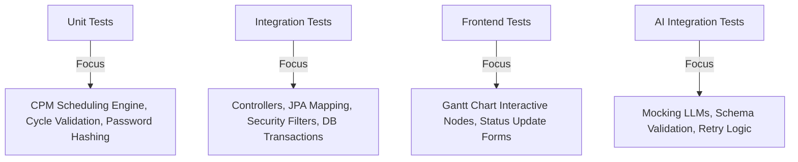

# Testing Strategy

This document outlines the testing frameworks, test classifications, coverage targets, and methodologies for verifying functional code and AI integration stability.

---

## Testing Framework Stack

### Backend (Java)
* **JUnit 5**: Core testing framework.
* **Mockito**: Mocking dependencies and services.
* **Spring Boot Test**: Integration testing helper containing `@SpringBootTest` and `MockMvc` for controller testing.
* **Testcontainers (Optional / Post-MVP)**: Spin up real PostgreSQL containers for integration tests. For the MVP, a dedicated PostgreSQL test schema or H2 database in PostgreSQL compatibility mode will be used.

### Frontend (React + TypeScript)
* **Vitest / Jest**: Test runner.
* **React Testing Library (RTL)**: Rendering components and simulating user interactions.
* **MSW (Mock Service Worker)**: Intercepting and mocking API calls to verify component behavior in isolation.

---

## Test Classifications

### 1. Unit Tests
* **Target Areas**:
  * Scheduling Engine: Critical Path Method (CPM) math (checks correct start/end date logic).
  * Cycle Detection: Validating that adding dependency loops throws `IllegalArgumentException`.
  * Common Validators: Email checks, budget validation rules.
* **Strategy**: Pure Java tests using JUnit 5 and Mockito. Fast execution (under 1 second total).

### 2. Integration Tests
* **Target Areas**:
  * Secure endpoints (JWT authorization checks).
  * Cascading DB deletes (e.g., deleting a Project deletes its Tasks).
  * Transaction rollback (validating database rollback if milestone insertion crashes halfway).
* **Strategy**: Use `@SpringBootTest` configured with a test profile. Use `MockMvc` to perform mock HTTP calls and assert JSON response formats.

### 3. Frontend Component Tests
* **Target Areas**:
  * Gantt chart nodes rendering correctly.
  * Form field checks (preventing submission when budget is negative).
  * Dashboard indicators displaying risk badges based on API outputs.
* **Strategy**: RTL tests asserting DOM states and simulation of clicks and keyboard inputs.

### 4. AI & Integration Validation
Since querying external LLMs in automated test pipelines is slow, costly, and non-deterministic, we will use a split strategy:
* **Mocked Integration Testing**: Use Mockito or Mock Rest Service Servers to simulate LLM responses. Mock standard responses, malformed JSON responses, and HTTP error timeouts.
* **Schema Parsing Testing**: Run parser tests against a catalog of pre-saved, static LLM responses (both valid and malformed JSON logs) to verify schema mapping, exception throwing, and recovery mechanisms.
