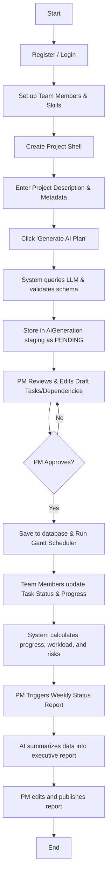

# Core User Flow Specification

This document details the step-by-step user journeys for the two primary roles in the AI Project Manager platform, followed by a graphical user-flow diagram.

---

## Step-by-Step User Flow

### 1. Account Setup and Authentication
1. The **Project Manager (PM)** navigates to the registration page, enters credentials, selects the "Project Manager" role, and signs up.
2. The PM logs in and receives a JWT token, redirecting them to the main Project Dashboard.
3. The PM adds **Team Members** to the organization registry and configures their skills and capacities.

### 2. Project Initialization and AI Planning
1. The PM clicks "Create New Project" and enters:
   * Project Name & Description
   * Start Date & Deadline
   * Total Budget
   * Proposed Methodology (Waterfall or Scrum)
   * Team Size
2. The system creates the blank project, and redirects the PM to the **AI Plan Generator** view.
3. The PM inputs a natural language description (e.g., *"Build a responsive React application with a Spring Boot backend and PostgreSQL database, including JWT authentication and email notification services"*).
4. The PM clicks "Request AI Plan".
5. The system wraps this prompt in a system instruction template, executes a call to the LLM API, parses the response into a structured JSON schema, and stores it in the `ai_generations` staging table in `PENDING_APPROVAL` status.
6. The PM reviews the suggested Milestones, Tasks, Durations, and Dependencies in an interactive draft view.
7. The PM can modify fields (e.g., changing a task name, duration, or dependency relationship).
8. The PM clicks **Approve Plan**.
9. The system sets the `ai_generations` status to `APPROVED`, converts the staged milestones and tasks into live `milestone` and `task` records in the database, and calls the Scheduling Service to compute the Gantt chart schedule.

### 3. Tracking & Daily Progress
1. Assigned **Team Members** log into the platform. They see a list of their assigned tasks and the overall Gantt chart.
2. A Team Member changes a task's status from *To Do* to *In Progress* and inputs percentage progress (e.g., 50%).
3. The backend recalculates project metrics:
   * Overall project progress (aggregate completed weights).
   * Budget burn rate (hours logged * team member cost rates compared to total budget).
   * Workload allocation (identifying if a member is over-allocated for active tasks during the week).
   * Scheduling delays (if a task on the critical path is running behind).
4. Detected risks are registered as `Risk` objects in the database and shown on the dashboard.

### 4. Status Reporting
1. At the end of a sprint or week, the PM navigates to the "Reports" panel and clicks "Draft Status Report".
2. The backend compiles current project metadata (completed tasks, delays, workloads, budget figures, and risks) and formats it into a summary payload.
3. The LLM processes the payload and returns a Markdown-formatted executive summary and recommendations.
4. The PM reviews, edits the draft, and saves it. The final report is stored in the database for reference.

---

## User Flow Diagram

The following Mermaid diagram visualizes the interactive workflow:

